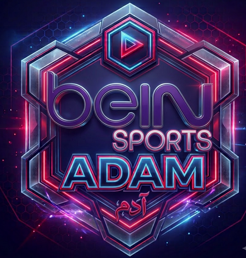

<div align="center">
  
  <h1>BEIN Sports Streaming</h1>
  <p><strong>بث المباريات مباشر — Free 12-channel BEIN Sports streaming with HD quality, live matches, and multi-source support</strong></p>
  <p>
    
    
    
    
    
  </p>
  <h3>🌐 <a href="https://adam-bein.vercel.app">adam-bein.vercel.app</a></h3>
</div>

---

## 📋 Overview

Free BEIN Sports streaming proxy delivering **12 live channels** — BEIN Sports 1-6 and BEIN Sports MAX 1-6 — with multi-source support, quality selection (360p–1080p), and a dynamic match schedule. Built from reverse-engineering the Buz Cup Android app, deployed serverless on Vercel.

Works on **iPhone, iPad, Android, desktop, laptop, and Smart TV** with full Arabic/English interface.

---

## ✨ Features

### 📺 Streaming
| Feature | Details |
|---|---|
| **12 channels** | BEIN Sports 1–6 + BEIN Sports MAX 1–6 |
| **4 sources** | Primary (man1ted), VACO R2, YallaHD Workers, Amagi US |
| **Quality selector** | 360p / 480p / 720p HD / 1080p FHD |
| **Auto quality detect** | HLS reports actual stream resolution vs selector |
| **Smooth refresh** | Token-based sources refresh before expiry (no stutter) |
| **Auto-reconnect** | Exponential backoff on network errors |
| **HLS.js optimized** | 60s buffer, backbuffer 30s, max 150MB |
| **Picture-in-Picture** | Native PiP button (iOS + desktop) |

### ⚽ Live Matches
| Feature | Details |
|---|---|
| **Auto-updating** | Fetches from ESPN API, refreshes every 10min |
| **FIFA World Cup priority** | World Cup matches show first with 🏆 badge |
| **🔴 LIVE indicator** | In-progress matches highlighted |
| **Countdown timers** | Shows "بعد 45 د" for matches starting within 3h |
| **League filter** | Filter by competition (UCL, Premier League, La Liga, etc.) |
| **Click to watch** | Tap any match → auto-switches to its BEIN channel |
| **Match count badge** | Shows number of matches on the tab |

### 🎨 Design
- **Glassmorphism dark theme** with animated gradient background
- **Cairo (Arabic) + Inter (English)** Google Fonts
- **Responsive** — phone → tablet → desktop → TV (4K/8K 10-foot UI)
- **Smooth animations** — fade-up cards, glow pulses, hover lifts
- **Add to Home Screen** — PWA manifest + apple-touch-icon
- **Safe area insets** — respects iPhone notch + home indicator
- **`playsinline`** — no forced fullscreen on iOS Safari

### ⌨️ Controls
| Shortcut | Action |
|---|---|
| `1`–`6` | Switch to BEIN Sports 1–6 |
| `F` | Toggle fullscreen |
| `M` | Mute/unmute |
| `Space` | Play/pause |
| `P` | Picture-in-Picture |
| `Esc` | Close settings/overlays |

### ⭐ Personalization
- **Favorites** — right-click/star any channel, stored in localStorage
- **Recents** — last 5 channels shown as quick-access chips
- **Settings panel** — auto-play, auto-reconnect, notifications, night mode
- **Source preference** — persists per session

---

## 🚀 Quick Start

### Web (zero setup)
```
https://adam-bein.vercel.app
```

### Local Proxy (lower latency)
```bash
python3 bein-server-v6.py
# → http://localhost:8000
```

---

## 📡 Sources

| Source | Type | Qualities | Auth | Refresh |
|---|---|---|---|---|
| **man1ted** (رئيسي) | API → BuzCup proxy | 360p / 480p / 720p / 1080p | BuzCup UA via backend | Token (600s, auto-refresh) |
| **VACO R2** (احتياطي) | Cloudflare direct M3U8 | Single | None | None |
| **YallaHD** (إضافي) | Cloudflare Workers | Single | None | None |
| **Amagi** (مجاني) | US BEIN XTRA free | 720p / 1080p | None (ad-supported) | None |

---

## 📖 API

| Endpoint | Method | Description |
|---|---|---|
| `/` | GET | Main streaming UI |
| `/api/channel?ch=CHANNEL&q=QUALITY` | GET | Get stream URL + token (360/480/720/1080) |
| `/api/proxy?url=URL` | GET | Proxy HLS manifest/segments with BuzCup UA |
| `/api/matches` | GET | Live match schedule with BEIN channel mapping |
| `/api/matches?date=YYYYMMDD` | GET | Matches for a specific date |
| `/creds` | GET | View captured credentials (testing only) |
| `/clear` | POST | Clear captured credentials (testing only) |
| `/check` | GET | Health check |

### Channel IDs
```
beee1  — BEIN Sports 1      beemax1 — BEIN MAX 1
beee2  — BEIN Sports 2      beemax2 — BEIN MAX 2
beee3  — BEIN Sports 3      beemax3 — BEIN MAX 3
beee4  — BEIN Sports 4      beemax4 — BEIN MAX 4
beee5  — BEIN Sports 5      beemax5 — BEIN MAX 5
beee6  — BEIN Sports 6      beemax6 — BEIN MAX 6
```

---

## 🔧 Architecture

```
Browser ←──→ Vercel Edge ──→ /api/channel ──→ man1ted.com (BuzCup UA)
                │                    │
                │                    └──→ Returns M3U8 URL + token
                │                    │
                │              /api/proxy ──→ Proxies M3U8/TS segments
                │                    │
                │              /api/matches ──→ ESPN API → BEIN channel map
                │
                └──→ Serves index.html (PWA, responsive)
```

---

## 🖥️ Device Compatibility

| Device | Playback | Fullscreen | PiP | Install |
|---|---|---|---|---|
| **iPhone** | Native HLS (Safari) | ✅ Native | ✅ | Add to Home Screen |
| **iPad** | Native HLS | ✅ | ✅ | Add to Home Screen |
| **Android** | HLS.js | ✅ | ✅ | Install via prompt |
| **Windows/Mac** | HLS.js | ✅ (F) | ✅ (P) | — |
| **Linux** | HLS.js | ✅ | ✅ | — |
| **Smart TV** | HLS.js (10ft UI) | ✅ | ❌ | — |
| **Fire Stick** | HLS.js | ✅ | ❌ | — |

---

## 🏗 Deployment

### Vercel (primary)
```bash
vercel --prod --yes
# → https://adam-bein.vercel.app
```

### Local server
```bash
# Requirements
pip install flask requests

# Run
python3 bein-server-v6.py
# → http://localhost:8000
```

---

## 🛠 Tech Stack

- **Frontend:** Vanilla HTML/CSS/JS + HLS.js
- **Backend:** Python WSGI (Vercel serverless)
- **Fonts:** Cairo (Arabic), Inter (English) — Google Fonts
- **Streams:** HLS (adaptive bitrate)
- **Matches:** ESPN public API
- **Hosting:** Vercel (serverless), Cloudflare R2, Cloudflare Workers
- **Source:** man1ted.com (reverse-engineered BuzCup v2.0.0)

---

## 📜 Changelog

### v4 (current) — Multi-source + PWA + OG image
- Added 3 backup sources (VACO R2, YallaHD, Amagi US)
- 4-source dropdown with per-source quality handling
- PWA manifest + apple-touch-icon + home screen install
- Open Graph + Twitter Card previews with logo
- Full responsive: iOS safe areas, -webkit-fill-available, playsinline
- Social share OG image (1200×630) with logo
- Matches: FIFA World Cup priority, league filter, countdown timers

### v3 — Glassmorphism redesign + keyboard shortcuts
- Complete visual overhaul with animated gradient background
- Glassmorphism cards with backdrop-filter
- Keyboard shortcuts (1-6, F, M, Space, P)
- Favorites system (localStorage)
- Recent channels (last 5)
- Settings panel (auto-play, reconnect, night mode, notifications)
- PiP button + stream info overlay
- Channel grid with hover/glow effects

### v2 — Quality selector + dynamic matches
- Quality dropdown (360p–1080p)
- Live matches via ESPN API
- HLS.js buffer tuning (60s)
- Token refresh at 480s (smooth)
- Cold start warm-up

### v1 — Initial release
- 12 BEIN channels via man1ted.com API
- HLS playback with HLS.js
- Vercel deployment
- Basic channel grid
